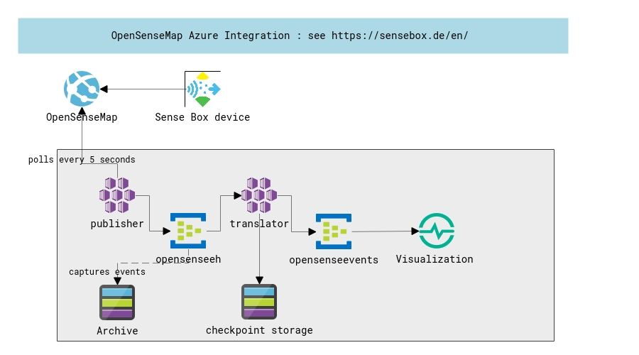

# Sample showing OpenSenseMap integration with Azure services

 

Using Spring Boot for microservices and Spring Cloud Streaming over Azure Event Hubs

## Configuration

The Publisher and Protocol-Translater microservices are using Azure Event Hubs from an Event Hub namespace. Both components assume to get the connection string to the Event Hub namespace from an environment variable with the name EHConnectionString. The Protocol Translator additionally needs the Storage Access key in the environment variable EHStorageAccessKey.
