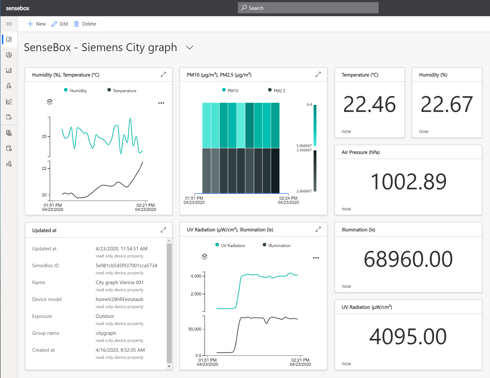

# Sample showing how to integrate SenseBox devices with Azure IoT

[SenseBoxes](https://sensebox.de/en/) are smart devices that can be used to monitor environment conditions like temperature, humidity and so on. [OpenSenseMap](https://opensensemap.org/) provides a Web based user interface to visualize the current values of the SenseBox sensors and provides an [API](https://github.com/sensebox/openSenseMap-API) to access the telemetry data. This sample shows how to integrate SenseBox devices with Azure IoT Services, like [Time Series Insights](https://azure.microsoft.com/en-us/services/time-series-insights/) and [Azure IoT Central](https://azure.microsoft.com/en-in/services/iot-central/), by leveraging this API.

This sample provides [IoT Plug&Play](https://docs.microsoft.com/en-us/azure/iot-pnp/) support for Azure IoT by providing a [Device capability model](https://github.com/JMayrbaeurl/opensensemap-azure-integration/blob/master/device%20models/senseBox_home.capabilitymodel.json) for the [SenseBox:home](https://sensebox.de/en/products) device.

## Configuration for a single device

Currently only sending the latest measurements of one single senseBox is supported. Put the SenseBox ID in the [Spring Boot property](https://docs.spring.io/spring-boot/docs/2.1.8.RELEASE/reference/html/boot-features-external-config.html) `opensensemap.publisher.boxid`. The send frequency is defined in the [Spring Boot property](https://docs.spring.io/spring-boot/docs/2.1.8.RELEASE/reference/html/boot-features-external-config.html) `opensensemap.publisher.fixedRate` and defaults to 60000 (in milliseconds -> 1 minute default).

Use one of the following options:

* IoT Hub configuration with [connection string](https://docs.microsoft.com/en-us/azure/iot-hub/tutorial-connectivity#check-device-to-cloud-connectivity): [Spring Boot property](https://docs.spring.io/spring-boot/docs/2.1.8.RELEASE/reference/html/boot-features-external-config.html) `sensorbox.publisher.iothub.connectionstring`
* [IoT DPS configuration with symmetric keys](https://docs.microsoft.com/en-us/azure/iot-dps/concepts-symmetric-key-attestation#group-enrollments):
  * DPS Scope ID: [Spring Boot property](https://docs.spring.io/spring-boot/docs/2.1.8.RELEASE/reference/html/boot-features-external-config.html) `sensorbox.publisher.dps.scope`
  * DPS Registration ID: [Spring Boot property](https://docs.spring.io/spring-boot/docs/2.1.8.RELEASE/reference/html/boot-features-external-config.html) `sensorbox.publisher.dps.deviceID`
  * DPS Device Key: [Spring Boot property](https://docs.spring.io/spring-boot/docs/2.1.8.RELEASE/reference/html/boot-features-external-config.html) `sensorbox.publisher.dps.deviceKey`

## Configuration for multiple devices

Currently only [IoT DPS with symmetric keys](https://docs.microsoft.com/en-us/azure/iot-dps/concepts-symmetric-key-attestation#group-enrollments) enabled scenarios are supported for multiple senseBox devices.

* [IoT DPS configuration with symmetric keys](https://docs.microsoft.com/en-us/azure/iot-dps/concepts-symmetric-key-attestation#group-enrollments):
  * DPS Scope ID: [Spring Boot property](https://docs.spring.io/spring-boot/docs/2.1.8.RELEASE/reference/html/boot-features-external-config.html) `sensorbox.publisher.dps.scope`
  * Boxes configuration: Comma separated list of box configuration in [Spring Boot property](https://docs.spring.io/spring-boot/docs/2.1.8.RELEASE/reference/html/boot-features-external-config.html) `sensorbox.publisher.dps.boxesCreds`. E.g. "Box1ID;Box1DeviceKey;Box1DeviceKey,Box2ID;Box2DeviceKey;Box2DeviceKey" (See DPS configuration for a single device. Be careful with used characters)

## Running the component

The component that sends the SenseBox latest measurements to Azure IoT Hub can be run as Java process or as Docker container. E.g. as [Docker container](https://hub.docker.com/repository/docker/jmayrbaeurl/sensebox-publisher):

```bash
docker run -d --name sensebox-publisher \
--env opensensemap.publisher.boxid=5e981cb545f937001cca5734 \
--env sensorbox.publisher.dps.scope=[Insert your Scope ID] \
--env sensorbox.publisher.dps.deviceID=[Insert your Registration ID] \
--env sensorbox.publisher.dps.deviceKey=[Insert your key] jmayrbaeurl/sensebox-publisher
```

## Samples

### Azure Time Series Insights Integration


### Azure IoT Central Integration

Sample dashboard from Azure IoT Central showing measurements from a SenseBox:home device ([IoT Central Application template available](https://apps.azureiotcentral.com/build/new/137f45f1-26f3-4bf5-9d53-ad4daae2a2dc))

